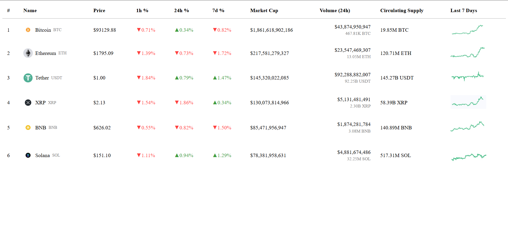

# 📈 Crypto Tracker

A dynamic crypto tracking web app that shows real-time updates of cryptocurrency prices, percentage changes, market cap, and more. Built using **React** and **Redux Toolkit**, this project simulates live updates for a modern, interactive dashboard experience.

---

## 🚀 Demo


-> (https://drive.google.com/file/d/1TDPH7kcb2K_ZuW7A4qznVj4YzQGyX7Nn/view?usp=sharing)

<!-- OR you can link a video if hosted -->

[Watch Demo]

-> (https://www.loom.com/share/06110deb29314fd08503e78647f0c8b6?sid=0ba84296-c498-4654-b870-519fab23387d)

---

## 🛠️ Tech Stack

- **Frontend**: React, Redux Toolkit, CSS
- **Bundler**: Vite
- **Styling**: Plain CSS + Responsive design
- **State Management**: Redux Toolkit + useSelector/useDispatch
- **Simulated Live Updates**: `setInterval` inside `useEffect`

---

## 🧱 Architecture

src/
│
├── components/
│ └── Tracker.jsx // Main UI table for displaying data
│
├── redux/
│ ├── store.js # Redux store setup
│ └── trackerSlice.js # Slice for crypto data
│
├── assets/
│ └── demo.gif # Demo GIF or images
│
├── App.jsx # Main app entry point
└── main.jsx # Renders the app using ReactDOM

## 🚀 Setup Instructions

1. **Clone the repository:**

   ```bash
   git clone https://github.com/your-username/crypto-tracker.git
   cd crypto-tracker
   ```

2. **Install dependencies:**

   ```bash
   npm install
   ```

3. **Start the development server:**

   ```bash
   npm run dev
   ```

4. **Visit the app:**

   Open your browser and go to `http://localhost:5173` (default port for Vite).

## 📸 Screenshots

Here’s a preview of how the app looks:


